# LAPORAN PRAKTIKUM
## Mata Kuliah: Design Pattern
### Praktikum: Review Java Dasar <br>
- **Nama** : Nazril Kanahaya Akbar
- **NIM** : 2024573010105
- **Kelas** : TI 2A
- **Mata Kuliah** : Design Pattern

---

# BAB I
# PENDAHULUAN
## 1.1 Latar Belakang
Perkembangan teknologi informasi yang semakin pesat menuntut mahasiswa di bidang teknologi untuk memahami konsep dasar pemrograman secara mendalam, khususnya pemrograman berorientasi objek (Object-Oriented Programming/OOP). Bahasa pemrograman Java merupakan salah satu bahasa yang широко digunakan karena memiliki struktur yang kuat, mendukung OOP, serta banyak digunakan dalam pengembangan aplikasi skala kecil hingga besar.

Dalam OOP terdapat empat pilar utama yaitu Encapsulation, Inheritance, Polymorphism, dan Abstraction yang menjadi dasar dalam membangun program yang terstruktur, modular, dan mudah dikembangkan. Pemahaman terhadap konsep-konsep ini sangat penting karena menjadi fondasi dalam mempelajari materi lanjutan seperti design pattern.

Oleh karena itu, praktikum ini dilakukan untuk mereview kembali konsep dasar Java dan OOP melalui implementasi langsung dalam bentuk kode program. Dengan adanya praktikum ini, diharapkan mahasiswa dapat lebih memahami cara kerja OOP serta mampu menerapkannya dalam pengembangan perangkat lunak.

## 1.2 Tujuan Praktikum

Adapun tujuan dari praktikum ini adalah sebagai berikut:

1. Memahami kembali konsep dasar pemrograman Java.
2. Mengetahui dan memahami empat pilar utama dalam OOP yaitu 3. 3. 3. Encapsulation, Inheritance,  Polymorphism, dan Abstraction.
3. Mampu mengimplementasikan konsep OOP ke dalam program Java sederhana.
4. Melatih kemampuan dalam membuat class, object, serta hubungan antar class.
5. Meningkatkan kemampuan dalam menulis kode yang terstruktur, modular, dan mudah dipahami.
6. Mempersiapkan dasar yang kuat untuk mempelajari konsep Design Pattern pada perkuliahan selanjutnya.

# BAB II
# PRAKTIKUM DAN LATIHAN
## 2.1 Empat pilar oop

Dalam pemrograman berorientasi objek (Object-Oriented Programming / OOP), terdapat empat konsep utama yang 
menjadi dasar dalam membangun sebuah program yang terstruktur dan mudah dikembangkan. Keempat konsep tersebut
dikenal sebagai **empat pilar OOP**, yaitu **Encapsulation, Inheritance, Polymorphism, dan Abstraction**.

---

### 1. Encapsulation (Enkapsulasi)
Encapsulation adalah konsep pembungkusan data (atribut) dan method (fungsi) dalam satu kesatuan yang disebut class. 
Pada konsep ini, data biasanya dibuat **private** agar tidak dapat diakses secara langsung dari luar class.

Untuk mengakses atau mengubah data tersebut, digunakan method khusus yaitu **getter** dan **setter**. 
Tujuan dari encapsulation adalah untuk menjaga keamanan data serta mengontrol bagaimana data diakses dan dimodifikasi.

---

### 2. Inheritance (Pewarisan)
Inheritance adalah konsep di mana sebuah class dapat mewarisi atribut dan method dari class lain.
Class yang mewarisi disebut **subclass (child class)**, sedangkan class yang diwarisi disebut **superclass (parent class)**.

Dengan inheritance, kita dapat menghindari penulisan kode yang berulang serta membuat struktur program lebih terorganisir.
Dalam Java, inheritance menggunakan keyword `extends`.

---

### 3. Polymorphism (Polimorfisme)
Polymorphism adalah konsep di mana satu method dapat memiliki banyak bentuk atau perilaku yang berbeda. 
Polymorphism terbagi menjadi dua jenis, yaitu:

- **Overloading**: method dengan nama yang sama tetapi parameter berbeda
- **Overriding**: method di subclass yang menggantikan method dari superclass

Konsep ini memungkinkan program menjadi lebih fleksibel dan mudah dikembangkan.

---

### 4. Abstraction (Abstraksi)
Abstraction adalah proses menyederhanakan kompleksitas dengan hanya menampilkan bagian penting saja dan menyembunyikan detail implementasi. 
Dalam Java, abstraction dapat dilakukan menggunakan **abstract class** dan **interface**.

Abstract class dapat memiliki method abstrak (tanpa isi) dan method biasa, sedangkan interface hanya berisi deklarasi
method yang harus diimplementasikan oleh class lain.

---

### Kesimpulan
Keempat pilar OOP sangat penting dalam pengembangan perangkat lunak karena membantu dalam membuat program yang
lebih terstruktur, modular, mudah dipelihara, dan dapat digunakan kembali. Dengan memahami dan menerapkan konsep ini,
seorang programmer dapat menulis kode yang lebih efisien dan rapi.

## 2.2 Langkah Praktikum
### 2.2.1 Bagian 1

1. Buka kembali project yang telah dibuat pada praktikum sebelumnya menggunakan IntelliJ IDEA.

2. Selanjutnya, buat package baru di dalam folder `src` dengan cara klik kanan pada folder tersebut, lalu pilih menu **New → Package**. Berikan nama package tersebut **Praktikum_3**.

3. Setelah itu, buat package baru lagi di dalam package `Praktikum_3` dengan langkah yang sama, yaitu klik kanan kemudian pilih **New → Package**, lalu beri nama **bagian_1**.

4. Kemudian, buat sebuah class baru dengan nama **Mahasiswa**, lalu isi class tersebut dengan kode berikut ini:
`mahasiswa.java`

```
package Praktikum_3.bagian_1;

public class mahasiswa {
// Atribut

    String nama;
    int umur;

    // Metode
    void displayInfo() {
        System.out.println("Nama:" + nama);
        System.out.println("Umur:" + umur);
    }

}
```
5. Buat sebuah class baru dengan nama `Main`. Pada praktikum ini, class dibuat terpisah untuk mempermudah dalam memahami setiap bagian, seperti class `Mahasiswa` dan lainnya.
Namun, perlu diketahui bahwa dalam Java, beberapa class sebenarnya dapat dibuat dalam satu file yang sama. Hal tersebut akan dicontohkan pada materi berikutnya.
```
package Praktikum_3.bagian_1;

public class main {
public static void main(String[] args) {
// Membuat object
mahasiswa mhs1 = new mahasiswa();
mhs1.nama = "Budi";
mhs1.umur = 20;

     //memanggil metode
       mhs1.displayInfo();
    }
}
```

Output: <br>
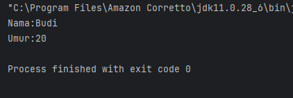

<b>Latihan<b>
1. Buat class Buku dengan atribut judul, penulis, dan tahunTerbit.
2. Buat objek dari class Buku dan tampilkan informasinya.
`buku.java`

```
package Praktikum_3.bagian_1.Latihan;

public class buku {
    // atribut
    String judul;
    String penulis;
    int TahunTerbit;

    void DisplayInfo(){
        System.out.println("Judul:" + judul);
        System.out.println("Penulis:" + penulis);
        System.out.println("TahunTerbit:" + TahunTerbit);

    }
}
```
`main.java`

```
package Praktikum_3.bagian_1.Latihan;

public class main {
    public static void main (String[] args){
        //Menbuat object
        buku detail1 = new buku();
        detail1.judul = "Children of Dune";
        detail1.penulis = "Frank Herbert";
        detail1.TahunTerbit = 1976;

        detail1.DisplayInfo();
    }
}

```
<b> Output </b>
<br>
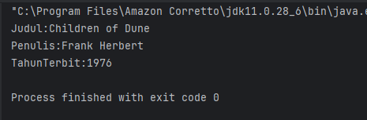


### 2.2.2 Bagian dua Encapsulation
Encapsulation merupakan konsep dalam OOP yang bertujuan untuk melindungi data internal suatu objek dengan cara 
menyembunyikannya dari akses langsung. Akses terhadap data tersebut hanya dapat dilakukan melalui method tertentu 
yang disediakan. Hal ini biasanya diterapkan dengan menggunakan access modifier seperti private, public, dan protected, 
serta memanfaatkan method getter dan setter.

<b> Langkah Praktikum </b><br>

1. Buat kembali sebuah package baru di dalam package `Praktikum_3` dengan cara klik kanan, kemudian pilih **New → Package**, lalu beri nama **bagian_2**.
2. Selanjutnya, buat sebuah class baru dengan nama **Mahasiswa**, kemudian isi class tersebut dengan kode yang telah disediakan.
`Mahasiswa.java`

```
package Praktikum_3.bagian_2;

public class Mahasiswa {
    // Atrbut Private
    private  String nama;
    private int umur;

    //Getter and Setter
    public String getNama(){
        return nama;
    }

    public void setNama(String nama){
        this.nama = nama;
    }

    public int getUmur() {
        return umur;
    }

    public void setUmur(int umur){
        this.umur = umur;
    }

}
```
3. Kemudian buat Calass baru dengan nama `main` di sini saya membuat class main di file `main.java`.

```
package Praktikum_3.bagian_2;

public class main {
    public static void main(String[] args){
        Mahasiswa mhs1 = new Mahasiswa();
        mhs1.setNama("Budi");
        mhs1.setUmur(20);

        System.out.println("Nama:" + mhs1.getNama());
        System.out.println("Umur:" + mhs1.getUmur());

    }

}
```

<b> Output </b>
<br>
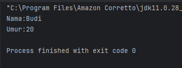
<br>

<b>Latihan</b>
1. Buat class Motor dengan atribut merk dan tahun yang dienkapsulasi.
2. Buat getter dan setter untuk atribut tersebut.
`Motor.java`

```
package Praktikum_3.bagian_2.Latihan;

public class motor {
    // Atribute Private
    private String merek;
    private int tahun;

    // getter
    public String getMerek() {
        return merek;
    }

    public int getTahun() {
        return tahun;
    }

    // setter
    public void setMerek(String merek){
        this.merek = merek;
    }

    public void setTahun(int tahun) {
        this.tahun = tahun;
    }
}

```
`main.java`

```
package Praktikum_3.bagian_2.Latihan;

public class main {
    public static void main(String[] args){
        motor mtr1 = new motor();
        mtr1.setMerek("BMW s1000rr");
        mtr1.setTahun(2006);

        System.out.println("Merek:" + mtr1.getMerek());
        System.out.println("Merek:" + mtr1.getTahun());

    }
}
```
<b>Output</b>
<br>
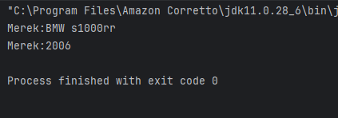

### 2.2.3 Bagian Tiga Inheritance

Dalam pemrograman berorientasi objek (OOP), terdapat dua konsep penting yang digunakan untuk membangun hubungan antar class, yaitu Inheritance dan Composition. Kedua konsep ini memiliki tujuan yang sama, yakni meningkatkan penggunaan ulang kode (reusability) serta membuat program lebih modular. Namun, keduanya memiliki pendekatan yang berbeda dalam penerapannya. Berikut penjelasan mengenai Inheritance beserta karakteristiknya.

### Inheritance (Pewarisan)
Inheritance merupakan mekanisme di mana suatu class turunan (subclass atau child class) memperoleh atribut dan method dari class induk (superclass atau parent class). Konsep ini menggambarkan hubungan **"is-a"**, yaitu suatu objek merupakan bagian dari jenis objek lain. Contohnya, Kucing adalah Hewan.

### Ciri-Ciri Inheritance:
- Menggunakan keyword `extends` dalam Java.
- Subclass dapat mewarisi atribut dan method dari superclass, kecuali yang memiliki akses `private`.
- Subclass dapat menambahkan atribut atau method baru sesuai kebutuhan.
- Method yang diwarisi dapat diubah (override) oleh subclass.
- Mendukung pembentukan hierarki class, di mana sebuah class hanya dapat mewarisi dari satu superclass.

<b>Langkah Praktikum</b>
<br>
1. Buat kembali sebuah package baru di dalam package `Praktikum_3` dengan cara klik kanan, kemudian pilih **New → Package**, lalu beri nama **bagian_3**.

2. Selanjutnya, buat package baru di dalam package `bagian_3` dengan langkah yang sama, kemudian beri nama **pewarisan**.

3. Setelah itu, buat sebuah class baru dengan nama **Kendaraan**, lalu isi class tersebut dengan kode berikut:
`Kendaran.java`

```
package Praktikum_3.bagian_3.pewarisan;

public class kendaraan {
    String merek;
    int tahun;

    void displayInfo(){
        System.out.println("Merek:" + merek);
        System.out.println("Tahun:" + tahun);
    }
}

```
4. Kemudian buat sebuah Class dengan nama `mobil` disini saya membuat class mobil di file `mobil.java` jadi terpisah.

```
package Praktikum_3.bagian_3.pewarisan;

public class mobil extends kendaraan {
    int jumblahPintu;

    void displayInfoMobil(){
        displayInfo(); // Memanggil metod dari superclass
        System.out.println("Jumblah Pintu:" + jumblahPintu);

    }
}
```
5. Selanjutnya membuat class `main` di sini saya membuatnya di file `main.java` yang saya buat.

```
package Praktikum_3.bagian_3.pewarisan;

public class main {
    public static void main(String[] args){
        mobil mobil1 = new mobil();
        mobil1.merek = "Toyota";
        mobil1.tahun = 2021;
        mobil1.jumblahPintu = 4;

        mobil1.displayInfoMobil();
    }
}
```
<b>Output</b>
<br>
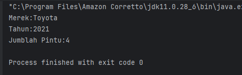 <br>


### Composition (Komposisi)

Composition merupakan konsep di mana suatu class dibangun dari objek-objek yang berasal dari class lain. Konsep ini menunjukkan hubungan **"has-a"** atau “memiliki”. Sebagai contoh, sebuah Mobil memiliki Mesin. Dengan composition, kita dapat membentuk class yang lebih kompleks dengan cara menggabungkan beberapa objek yang lebih sederhana.

### Ciri-Ciri Composition:
- Menggunakan objek dari class lain sebagai atribut (instance variable).
- Tidak memerlukan keyword khusus, cukup dengan membuat objek di dalam class.
- Lebih fleksibel dibandingkan inheritance karena tidak bergantung pada hubungan hierarki.
- Mendukung penggunaan kembali kode (reusability) tanpa harus melakukan pewarisan.

<b>Langkah Praktikum</b><br>

1. Buat sebuah package baru di dalam package `bagian_3` dengan cara klik kanan, kemudian pilih **New → Package**, lalu beri nama **komposisi**.

2. Selanjutnya, buat sebuah class baru dengan nama **Mesin**, kemudian isi class tersebut dengan kode berikut:
`Mesin.java`

```
package Praktikum_3.bagian_3.compotition;

public class Mesin {
    void hidupkan(){
        System.out.println("Mesin menyala.");
    }

    void matikan() {
        System.out.println("Mesin di matikan");
    }
}
```
3. Kemudian buat Class baru dengan nama `mobil` di file `mobil.java`.

```
package Praktikum_3.bagian_3.compotition;

public class mobil {
    private final Mesin mesin; //Compotition

    public mobil() {
        this.mesin = new Mesin();
    }

    void mulai() {
        mesin.hidupkan();
        System.out.println("Mobil siap digunakan.");
    }

    void berhenti(){
        mesin.matikan();
        System.out.println("Mobil berhenti.");
    }
}
```
4. Kemudian buat Class `main` di file `main.java` untuk menampilkan dan menjalankan kodenya.

```
package Praktikum_3.bagian_3.compotition;

public class main {
    public static void main(String[] args){
        mobil mobil = new mobil();
        mobil.mulai();
        mobil.berhenti();
    }
}
```
<b>Output</b><br>
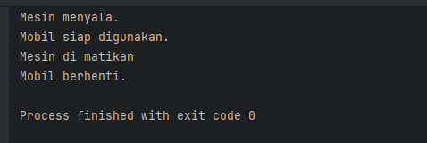 <br>

### Kapan Menggunakan Inheritance dan Composition?

Pemilihan antara inheritance dan composition bergantung pada jenis hubungan antar class yang ingin dibangun.

#### Gunakan Inheritance jika:
- Terdapat hubungan **"is-a"** yang jelas antar class, misalnya Mobil merupakan Kendaraan.
- Ingin mewarisi atribut dan method dari superclass secara langsung.
- Perlu melakukan perubahan atau penyesuaian method dari superclass melalui proses overriding.

#### Gunakan Composition jika:
- Terdapat hubungan **"has-a"** atau “memiliki”, seperti Mobil yang memiliki Mesin.
- Ingin membentuk class yang terdiri dari beberapa objek yang lebih sederhana.
- Ingin mengurangi ketergantungan antar class (low coupling) sehingga lebih fleksibel.

Selain itu, dalam praktiknya inheritance dan composition juga dapat digunakan secara bersamaan untuk menghasilkan desain program yang lebih baik.

<b>Langkah Praktikum<b><br>
1. Dalam package 3 buat class dengan nama `main` dan isi dengan kode berikut:

```
package Praktikum_3.bagian_3;

// Class untuk Composition
class Mesin {
    void hidupkan(){
        System.out.println("Mesin Menyala");
    }
    void matikan(){
        System.out.println("Mesin dimatikan");
    }
}

// Superclass untuk Inheritance
class kendaraan {
    void bergerak(){
        System.out.println("Kendaraan Sedang Bergerak");
    }
}

// Subclass
class Mobil extends kendaraan {
    private Mesin mesin; // Composition

    public Mobil() {
        this.mesin = new Mesin(); // membuat objek Mesin
    }

    void mulai() {
        mesin.hidupkan();
        System.out.println("Mobil siap digunakan");
    }

    void berhenti() {
        mesin.matikan();
        System.out.println("Mobil berhenti");
    }
}

// Main class
public class main {
    public static void main(String[] args) {
        Mobil mobil = new Mobil();
        mobil.mulai();
        mobil.bergerak();
        mobil.berhenti();
    }
}
```
<b>Output</b>

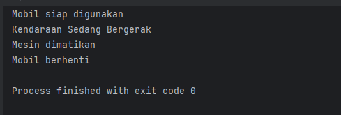 <br>

<b>Latihan</b><br>

1. Buat class Laptop yang memiliki komponen Processor dan RAM (gunakan composition).
2. Buat class Processor dengan metode jalankan().
3. Buat class RAM dengan metode baca() dan tulis().
4. Implementasikan class Laptop yang menggunakan objek Processor dan RAM.

```
package Praktikum_3.bagian_3.Latihan;

// Class Processor
class Processor {
    void jalankan() {
        System.out.println("Processor sedang berjalan");
    }
}

// Class RAM
class RAM {
    void baca() {
        System.out.println("RAM membaca data");
    }

    void tulis() {
        System.out.println("RAM menulis data");
    }
}

// Class Laptop (Composition)
class Laptop {
    private Processor processor;
    private RAM ram;

    // Constructor
    public Laptop() {
        this.processor = new Processor();
        this.ram = new RAM();
    }

    void nyalakanLaptop() {
        System.out.println("Laptop dinyalakan");
        processor.jalankan();
        ram.baca();
        ram.tulis();
    }
}

// Main class
public class main {
    public static void main(String[] args) {
        Laptop laptop = new Laptop();
        laptop.nyalakanLaptop();
    }
}
```
<strong> note:</strong>Kode di atas menunjukkan bahwa class bisa di buat di dalam satu file yang sama tampa harus memisahkannya.<br>

<b>Output</b> <br>
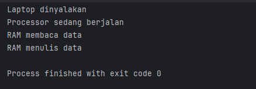 <br>

### 2.2.4 Bagian Empat Polymorphism 

### Polymorphism

Polymorphism adalah konsep yang memungkinkan suatu objek memiliki lebih dari satu bentuk atau perilaku. 
Dalam Java, polymorphism dapat diterapkan melalui dua cara, yaitu **method overriding** dan **method overloading**.
Method overriding digunakan untuk mengganti implementasi method pada subclass, sedangkan method overloading memungkinkan 
penggunaan nama method yang sama dengan parameter yang berbeda.

---

### Method Overriding

Method overriding terjadi ketika subclass (class turunan) memberikan implementasi baru terhadap method yang
telah didefinisikan di superclass (class induk). Tujuan dari overriding adalah untuk menyesuaikan atau memperluas
perilaku method yang diwarisi dari superclass.

Agar method dapat di-override dengan benar, method tersebut harus memiliki nama, parameter, dan tipe pengembalian
(return type) yang sama seperti yang ada di superclass.

---

### Aturan Method Overriding:
- Nama method dan parameter harus sama dengan yang terdapat pada superclass.
- Return type harus sama atau merupakan turunan (subtype) dari return type pada superclass.
- Access modifier tidak boleh lebih ketat dibandingkan dengan yang ada di superclass (misalnya, jika di superclass menggunakan `protected`, maka di subclass boleh `protected` atau `public`).
- Method yang dideklarasikan sebagai `final` di superclass tidak dapat di-override.

<b>Langkah Paraktikum</b>
1. Buat kembali sebuah package baru di dalam package `Praktikum_3` dengan cara klik kanan, kemudian pilih **New → Package**, lalu beri nama **bagian_4**.

2. Selanjutnya, buat package baru di dalam package `bagian_4` dengan langkah yang sama, kemudian beri nama **overriding**.

3. Setelah itu, buat sebuah class baru dengan nama **Hewan**, lalu isi class tersebut dengan kode berikut:

`Hewan.java`

```
package Praktikum_3.bagian_4.overriding;

public class Hewan {
    void bersuara(){
        System.out.println("Hewan bersuara.");
    }
}
```
4. Buat Class dengan nama `kucing`
kucing.java

```
package Praktikum_3.bagian_4.overriding;

import javax.swing.*;

public class kucing extends Hewan {
    @Override
    void bersuara() {
        System.out.println("Meong!");
    }
}
```

5. Selanjutnya buat satu Class lagi dengan nama `anjing`

```
package Praktikum_3.bagian_4.overriding;

public class anjing extends Hewan{
    @Override
    void bersuara() {
        System.out.println("Guk Guk!");
    }
}
```
6. Selanjutnya kita buat class `Main`

```
package Praktikum_3.bagian_4.overriding;

import Praktikum_1.HelloWorld;

public class main {
    public static void main(String[] args){
        Hewan hewan1 = new kucing();
        Hewan hewan2 = new anjing();

        hewan1.bersuara();
        hewan2.bersuara();
    }
}
```
7. Jalankan program dan berikut hasil dari program yang telah di buat:

<b>Output</b><br>
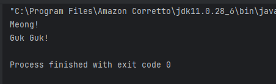 <br>

### Method Overloading

Method overloading adalah kondisi di mana dalam satu class terdapat beberapa method dengan nama yang sama, 
namun memiliki parameter yang berbeda, baik dari segi jumlah maupun tipe datanya. Konsep ini digunakan untuk
memberikan fleksibilitas, sehingga satu method dapat dipanggil dengan berbagai cara sesuai kebutuhan.

### Aturan Method Overloading:
- Nama method harus sama.
- Parameter harus berbeda, baik dari jumlah maupun tipe datanya.
- Tipe data kembalian (return type) boleh sama ataupun berbeda karena tidak memengaruhi overloading.
- Access modifier dapat menggunakan jenis yang sama maupun berbeda.

<b>Langkah Praktikum<b><br>

1. Buat sebuah package baru di dalam package `bagian_4` dengan cara klik kanan, kemudian pilih 
**New → Package**, lalu beri nama **overloading**.

2. Selanjutnya, buat sebuah class baru dengan nama **Kalkulator**, kemudian isi class tersebut dengan
kode berikut:

```
package Praktikum_3.bagian_4.overloading;

public class kalkulator {
    //method overloading: penjumblahan dua bilangan bulat
    int tambah(int a, int b){
        return a + b;
    }

    //method overloading: penjumblahan tiga bilangan bulat
    int tambah(int a, int b, int c){
        return a + b + c;
    }

    //method overloading: penjumblahan bilangan desimal
    double tambah(double a, double b){
        return a + b;
    }

}
```
3. Kemudian buat Class baru dengan nama `main` dan tuliskan kode di bawah ini lalu jalankan dan liat hasilnya:

```
package Praktikum_3.bagian_4.overloading;

public class main {
    public static void main(String[] args){
        kalkulator kalkulator = new kalkulator();

    System.out.println("Hasil1 " + kalkulator.tambah(5, 10));
    System.out.println("Hasil2 " + kalkulator.tambah(5, 10, 15));
    System.out.println("Hasil3 " + kalkulator.tambah(3.5, 2.5));
    }

}
```

<b>Output</b><br>
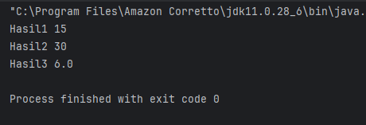 <br>

<b>Latihan</b><br>
<b>Latihan 1: Overriding</b>
1. Buat class BangunDatar dengan method hitungLuas().
2. Buat subclass Persegi dan Lingkaran yang meng-override method hitungLuas().
3. Implementasikan method hitungLuas() di masing-masing subclass.
4. 
<b>Latihan 2: Overloading</b>
1. Buat class Matematika dengan method tambah() yang dapat menerima 2 atau 3 parameter bertipe int.
2. Tambahkan method tambah() yang menerima 2 parameter bertipe double.

<b>Latihan 1: Overriding</b>

```
package Praktikum_3.bagian_4.Latihan;

// Superclass
class BangunDatar {
    double hitungLuas() {
        return 0;
    }
}

// Subclass Persegi
class Persegi extends BangunDatar {
    double sisi;

    Persegi(double sisi) {
        this.sisi = sisi;
    }

    @Override
    double hitungLuas() {
        return sisi * sisi;
    }
}

// Subclass Lingkaran
class Lingkaran extends BangunDatar {
    double jariJari;

    Lingkaran(double jariJari) {
        this.jariJari = jariJari;
    }

    @Override
    double hitungLuas() {
        return Math.PI * jariJari * jariJari;
    }
}

// Main class
public class Main {
    public static void main(String[] args) {
        Persegi p = new Persegi(4);
        Lingkaran l = new Lingkaran(7);

        System.out.println("Luas Persegi: " + p.hitungLuas());
        System.out.println("Luas Lingkaran: " + l.hitungLuas());
    }
}

```
<b>Output</b><br>
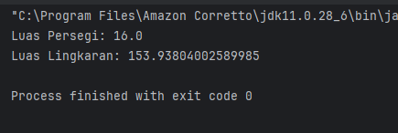 <br>

<b>Latihan 2: Overloading</b>

```
package Praktikum_3.bagian_4.Latihan;

class Matematika {

    // tambah 2 parameter int
    int tambah(int a, int b) {
        return a + b;
    }

    // tambah 3 parameter int
    int tambah(int a, int b, int c) {
        return a + b + c;
    }

    // tambah 2 parameter double
    double tambah(double a, double b) {
        return a + b;
    }
}

public class overloading {
    public static void main(String[] args) {
        Matematika m = new Matematika();

        System.out.println("2 int: " + m.tambah(2, 3));
        System.out.println("3 int: " + m.tambah(2, 3, 4));
        System.out.println("2 double: " + m.tambah(2.5, 3.5));
    }
}

```
<b>Output</b><br>
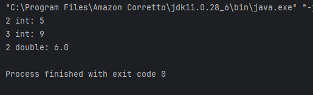 <br>

### 2.2.5 Bagian Lima Abstraction (Abstraksi) Abstract Class dan Interface

1. Buat kembali sebuah package baru di dalam package `Praktikum_3` dengan cara klik kanan, kemudian pilih **New → Package**, lalu beri nama **bagian_5**.

2. Selanjutnya, buat package baru di dalam package `bagian_5` dengan langkah yang sama, kemudian beri nama **abstrak**.

3. Setelah itu, buat sebuah class baru di dalam package `abstrak` dengan nama **Hewan**, lalu isi class tersebut dengan kode di bawah ini:
`Hewan.java`
```
package Praktikum_3.bagian_5.abstrak;

abstract class Hewan {
//Atribut
String nama;

    //Method konkret
    void makan(){
        System.out.println(nama + "Sedang makan.");
    }

    //Method Abstract
    abstract void bersuara();

}
```
4. Selanjutnya buat sebuah Class baru di dalam abtrak dengan nama `Kucing` dan isikan kode berikut:
`kucing.java`

```
package Praktikum_3.bagian_5.abstrak;

public class Kucing extends Hewan {
    @Override
    void bersuara(){
        System.out.println("Meong!");
    }
}

```

5. Kemudian buat Class baru dengan `anjing` di dalam package abstcak dan isikan kode berikut:
`anjing.java`

```
package Praktikum_3.bagian_5.abstrak;

public class anjing extends Hewan {
    @Override
    void bersuara() {
        System.out.println("Guk Guk!");
    }
}

```

6. Kemudian buat Class baru dengan nama `Main` unutk menampilkan dan menjalankan kode. Isikan kode berikut lalu jalankan:

```
package Praktikum_3.bagian_5.abstrak;

public class main {
    public static void main(String[] args){
        Hewan kucing = new Kucing();
        kucing.nama = "Kitty";
        kucing.makan(); //method konkret dari abstract class
        kucing.bersuara(); //method abstract yang di override

        Hewan anjing = new anjing();
        anjing.nama = "Doggy";
        anjing.makan(); //method konkret dari abstract class
        anjing.bersuara(); //method abstract yang di override
    }
}
```
<b>Output</b><br>
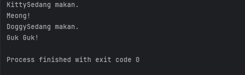

### Interface

Interface merupakan sebuah blueprint dalam pemrograman yang berisi kumpulan method yang harus diimplementasikan oleh class lain. Pada Java versi sebelum 8, interface hanya berisi method abstrak. Namun, начиная Java 8, interface dapat memiliki method default dan static, serta sejak Java 9 dapat memiliki method private. Interface digunakan untuk mendefinisikan kontrak yang wajib dipenuhi oleh class yang mengimplementasikannya. Selain itu, sebuah class dapat mengimplementasikan lebih dari satu interface (multiple inheritance).

---

### Ciri-Ciri Interface:
- Dideklarasikan menggunakan keyword `interface`.
- Secara default, semua method bersifat `public` dan `abstract`, sehingga tidak perlu menuliskan keyword tersebut secara eksplisit.
- Sejak Java 8, interface dapat memiliki method `default` (dengan implementasi) dan method `static`.
- Sejak Java 9, interface juga dapat memiliki method `private`.
- Tidak dapat memiliki atribut non-static, hanya dapat berisi konstanta (`public static final`).

<b>Langkah-Langkah Praktikum</b><br>
1. Buat sebuah package baru di dalam package `bagian_5` dengan cara klik kanan, kemudian pilih **New → Package**, lalu beri nama **antarmuka**.
2. Selanjutnya, buat sebuah interface baru di dalam package `antarmuka` dengan nama **Bergerak**, dengan cara klik kanan pada package antarmuka lalku kliknew selanjutnya klik java class
lalu pilih yang interface tepatnya berada di bawah pilihan Class kalian pilih Interface lalu isikan kode berikut:
`Bergerak.java`
```
package Praktikum_3.bagian_5.antarmuka;

public interface Bergerak {
    //method abstract
    void bergerak();

    default void berhenti(){
        System.out.println("Berhenti bergerak");
    }

    static void info(){
        System.out.println("Ini adalah interface Bergerak");
    }
}
```

3. Kemudian buat sebuah Class baru di dalam antarmuka dengan nama `Mobil` dan isikan kode berikut:
`Mobil.java`

```
package Praktikum_3.bagian_5.antarmuka;

public class Mobil implements Bergerak {
    @Override
    public  void bergerak(){
        System.out.println("Mobil sedang melaju");
    }
}
```

4. Selanjutnya buat sebuah class baru di dalam antarmuka dengan nama `Pesawat` dan isikan kode berikut:
`Pesawat.java`

```
package Praktikum_3.bagian_5.antarmuka;

public class Pesawat implements Bergerak {
    @Override
    public  void bergerak(){
        System.out.println("Pesawat sedang terbang");
    }
}
```

5. Yang terakhir buat sebuah class baru dengan nama `Main` dan isikan kode beri
`Main.java`

```
package Praktikum_3.bagian_5.antarmuka;

public class main {
    public static void main(String[] args){
        Bergerak mobil = new Mobil();
        mobil.bergerak();
        mobil.berhenti();

        Bergerak pesawat = new Pesawat();
        pesawat.bergerak();
        pesawat.berhenti();

        Bergerak.info(); //Method static dari interface
    }
}
```
<b>Output</b><br>
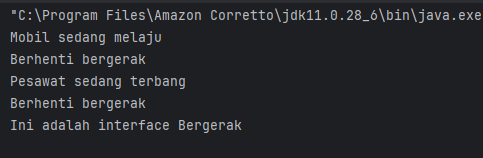

### Kapan Menggunakan Abstract Class dan Interface

Pemilihan antara abstract class dan interface bergantung pada kebutuhan serta desain program yang ingin dibuat.

#### Gunakan Abstract Class jika:
- Ingin membuat kerangka dasar (blueprint) untuk beberapa class yang memiliki kesamaan atribut dan perilaku.
- Membutuhkan method konkret yang dapat langsung digunakan atau diwariskan oleh subclass.
- Ingin mengatur atau menyimpan state objek melalui atribut non-static.

#### Gunakan Interface jika:
- Ingin menentukan kontrak atau kemampuan tertentu yang harus dimiliki oleh berbagai class.
- Membutuhkan dukungan multiple inheritance, di mana satu class dapat mengimplementasikan lebih dari satu interface.
- Ingin menambahkan fitur tambahan tanpa harus mengubah struktur utama class, misalnya dengan menggunakan method default (Java 8 ke atas).

Selain itu, dalam suatu program, abstract class dan interface juga dapat digunakan secara bersamaan untuk menghasilkan desain yang lebih fleksibel dan terstruktur.

<b>Langkah-Langkah Praktikum</b><br>
1. Didalam package bagian_5, buat Class baru dengan nama `Main` dan isikan kode berikut:

```
package Praktikum_3.bagian_5;

interface Terbang {
    void terbang();
}

// Abstract Class
abstract class Hewan {
    String nama;

    abstract void bersuara();
}

// Class yang mewarisi abstract class dan mengimplementasikan interface
class Burung extends Hewan implements Terbang {

    @Override
    void bersuara() {
        System.out.println("Kicau kicau!");
    }

    @Override
    public void terbang() {
        System.out.println(nama + " sedang terbang.");
    }
}

public class Main {
    public static void main(String[] args) {
        Burung burung = new Burung();
        burung.nama = "Merpati";
        burung.bersuara();
        burung.terbang();
    }
}
```
2. Jalankan program untuk melihat hasilnya.

<b>Output</b><br>
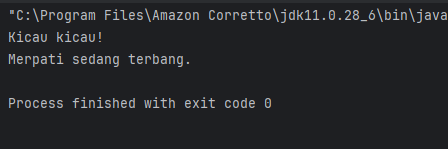

<b>Latihan</b><br>
1. Buat sebuah interface Berenang dengan method berenang().
2. Buat abstract class HewanAir dengan atribut nama dan method abstrak makan().
3. Buat class Ikan yang mewarisi HewanAir dan mengimplementasikan Berenang.
4. Implementasikan method berenang() dan makan() di class Ikan.


```
package Praktikum_3.bagian_5.Latihan;

// Interface
interface Berenang {
    void berenang();
}

// Abstract class
abstract class HewanAir {
    String nama;

    abstract void makan();
}

// Class Ikan (inherit + implements)
class Ikan extends HewanAir implements Berenang {

    @Override
    public void berenang() {
        System.out.println(nama + " sedang berenang.");
    }

    @Override
    void makan() {
        System.out.println(nama + " sedang makan.");
    }
}

// Main class
public class Main {
    public static void main(String[] args) {
        Ikan ikan = new Ikan();
        ikan.nama = "Ikan Nemo";

        ikan.berenang();
        ikan.makan();
    }
}
```
<b>Output</b><br>
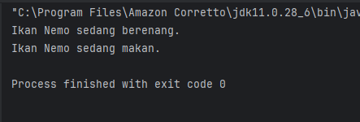

### 2.2.6 Bagian Enam  Aplikasi Console Pemesanan Tiket Sederhana

1. Buat package baru dengan nama `bagian_6` di dalaman package `Modul_3`
2. Kemudian buat sebuah class baru dengan nama `Tiket` dan masukkan kode di bawah ini:

```
package praktikum_3.bagian_6;

public abstract class Tiket {
private final String jenis;
private final double harga;

    public Tiket(String jenis, double harga) {
        this.jenis = jenis;
        this.harga = harga;
    }

    public String getJenis() {
        return jenis;
    }

    public double getHarga() {
        return harga;
    }

    public abstract double hitungDiskon();
}
```
3. Buat sebuah kelas baru dengan nama `TiketReguler`

```
package praktikum_3.bagian_6;

public class TiketReguler extends Tiket {
    public TiketReguler() {
        super("Reguler", 100000);
    }

    @Override
    public double hitungDiskon() {
        return 0;
    }
}
```
4. Buat class `TiketVIP` isikan kode di bawah ini

```
package praktikum_3.bagian_6;

public class TiketVIP extends Tiket {
    public TiketVIP() {
        super("VIP", 250000);
    }

    @Override
    public double hitungDiskon() {
        return 0.1 * getHarga();
    }
}
```
5. yang terakhir buat class `Pesanan`

```
package praktikum_3.bagian_6;

public class Pesanan {
    private final String namaPemesan;
    private final Tiket tiket;
    private final int jumlah;

    public Pesanan(String namaPemesan, Tiket tiket, int jumlah) {
        this.namaPemesan = namaPemesan;
        this.tiket = tiket;
        this.jumlah = jumlah;
    }

    public String getNamaPemesan() {
        return namaPemesan;
    }

    public Tiket getTiket() {
        return tiket;
    }

    public int getJumlah() {
        return jumlah;
    }

    public double hitungTotal() {
        double total = tiket.getHarga() * jumlah;
        double diskon = tiket.hitungDiskon() * jumlah;
        return total - diskon;
    }

    public void displayDetail() {
        System.out.println("\nDetail Pesanan:");
        System.out.println("Nama Pemesan: " + namaPemesan);
        System.out.println("Jenis Tiket: " + tiket.getJenis());
        System.out.println("Jumlah: " + jumlah);
        System.out.println("Total Harga: Rp." + hitungTotal());
    }
}

```
6. Yang terakhir buat class dengan nama `KonferensiApp`

```
package praktikum_3.bagian_6;

import java.util.ArrayList;
import java.util.Scanner;

public class KonferensiApp {
    private static final ArrayList<Pesanan> daftarPesanan = new ArrayList<>();
    private static final Scanner scanner = new Scanner(System.in);

    public static void main(String[] args) {
        while (true) {
            System.out.println("\n=== Aplikasi Pemesanan Tiket Konferensi ===");
            System.out.println("1. Lihat Daftar Tiket");
            System.out.println("2. Pesan Tiket");
            System.out.println("3. Lihat Detail Pesanan");
            System.out.println("4. Batalkan Pesanan");
            System.out.println("5. Keluar");
            System.out.println("Pilih Menu: ");
            int pilihan = scanner.nextInt();
            scanner.nextLine();

            switch (pilihan) {
                case 1:
                    lihatDaftarTiket();
                    break;
                case 2:
                    pesanTiket();
                    break;
                case 3:
                    lihatDetailPesanan();
                    break;
                case 4:
                    batalkanPesanan();
                    break;
                case 5:
                    System.out.println("Terimakasih telah menggunakan aplikasi ini.");
                    System.exit(0);
                default:
                    System.out.println("Pilihan tidak valid. Silahkan coba lagi.");
            }
        }
    }

    private static void lihatDaftarTiket() {
        System.out.println("\nDaftar Tiket:");
        System.out.println("1. Tiket Reguler - Rp100.000");
        System.out.println("2. Tiket VIP - Rp250.000 (Diskon 10%)");
    }

    private static void pesanTiket() {
        System.out.print("Masukkan Nama Pemesan: ");
        String namaPemesan = scanner.nextLine();

        System.out.print("Pilih Jenis Tiket (1: Reguler, 2: VIP): ");
        int jenisTiket = scanner.nextInt();
        System.out.print("Masukkan Jumlah Tiket: ");
        int jumlah = scanner.nextInt();

        Tiket tiket = null;
        switch (jenisTiket) {
            case 1:
                tiket = new TiketReguler();
                break;
            case 2:
                tiket = new TiketVIP();
                break;
            default:
                System.out.println("Jenis tiket tidak valid.");
                return;
        }

        Pesanan pesanan = new Pesanan(namaPemesan, tiket, jumlah);
        daftarPesanan.add(pesanan);
        System.out.println("Pesanan berhasil dibuat!");
        pesanan.displayDetail();
    }

    private static void lihatDetailPesanan() {
        if (isNoPesanan()) return;

        System.out.print("Pilih nomor pesanan untuk melihat detail: ");
        int nomorPesanan = scanner.nextInt();
        if (nomorPesanan > 0 && nomorPesanan <= daftarPesanan.size()) {
            daftarPesanan.get(nomorPesanan - 1).displayDetail();
        } else {
            System.out.println("Nomor pesanan tidak valid.");
        }

    }

    private static boolean isNoPesanan() {
        if (daftarPesanan.isEmpty()) {
            System.out.println("\nBelum ada pesanan.");
            return true;
        }

        System.out.println("\nDaftar Pesanan:");
        for (int i = 0; i < daftarPesanan.size(); i++) {
            System.out.println((i + 1) + ". " + daftarPesanan.get(i).getNamaPemesan());
        }
        return false;
    }

    private static void batalkanPesanan() {
        if (isNoPesanan()) return;

        System.out.print("Pilih nomor pesanan yang ingin dibatalkan: ");
        int nomorPesanan = scanner.nextInt();
        if (nomorPesanan > 0 && nomorPesanan <= daftarPesanan.size()) {
            daftarPesanan.remove(nomorPesanan - 1);
            System.out.println("Pesanan berhasil dibatalkan.");
        } else {
            System.out.println("Nomor pesanan tidak valid.");
        }
    }
}
```
<b>Output</b><br>
 <br>

