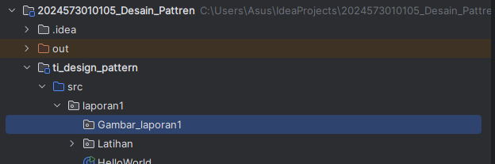
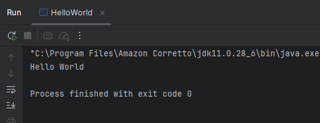
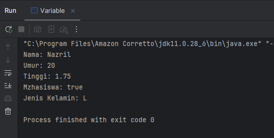
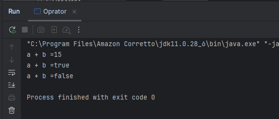
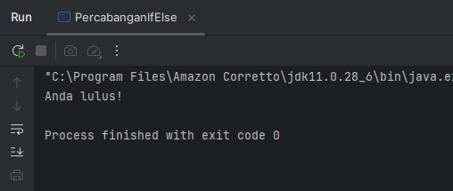
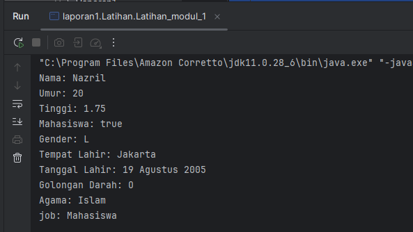
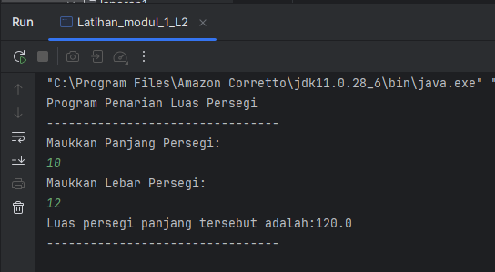
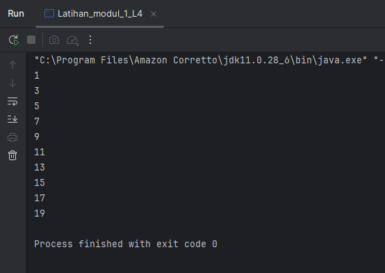

# LAPORAN PRAKTIKUM
## Mata Kuliah: Design Pattern
### Praktikum: Review Java Dasar <br>
- **Nama** : Nazril Kanahaya Akbar
- **NIM** : 2024573010105
- **Kelas** : TI 2A
- **Mata Kuliah** : Design Pattern

---

# BAB I
# PENDAHULUAN
## 1.1 Latar Belakang

Bahasa pemrograman Java merupakan salah satu bahasa pemrograman yang banyak digunakan dalam pengembangan perangkat lunak. Java dikenal sebagai bahasa pemrograman yang bersifat **object-oriented**, portabel, serta memiliki ekosistem yang luas. Oleh karena itu, pemahaman mengenai dasar-dasar Java menjadi hal yang penting sebelum mempelajari konsep yang lebih kompleks seperti design pattern.

Dalam praktikum ini dilakukan pengulangan materi mengenai dasar-dasar pemrograman Java seperti struktur program, variabel, serta cara menampilkan output pada layar. Variabel dalam Java berfungsi sebagai tempat penyimpanan data di dalam memori yang dapat digunakan untuk proses komputasi dalam program.

Melalui praktikum ini diharapkan mahasiswa dapat kembali memahami konsep dasar Java sehingga dapat menjadi fondasi yang kuat dalam mempelajari materi selanjutnya pada mata kuliah Design Pattern.

---

## 1.2 Tujuan Praktikum

Adapun tujuan dari praktikum ini adalah sebagai berikut:

1. Memahami kembali konsep dasar pemrograman Java.
2. Mengetahui struktur dasar program Java.
3. Memahami penggunaan variabel dalam bahasa pemrograman Java.
4. Melatih kemampuan mahasiswa dalam membuat dan menjalankan program Java sederhana.

---

# BAB II
# PRAKTIKUM DAN LATIHAN

## 2.1 Bahasa Pemrograman Java

Java merupakan bahasa pemrograman yang berorientasi objek dan dirancang agar dapat berjalan di berbagai platform melalui konsep **Write Once Run Anywhere (WORA)**. Hal ini memungkinkan program Java dijalankan pada berbagai sistem operasi selama terdapat Java Virtual Machine (JVM).

Java banyak digunakan dalam berbagai bidang pengembangan perangkat lunak seperti aplikasi desktop, aplikasi web, hingga pengembangan sistem enterprise.

---

## 2.2 Langkah Praktikum

1. Intall JDK dan Intellij IDE Community Edition
2. Buat sebuah projek dengan ketentuan brikut:
    - Name: ti_design_pattern
    - Location: disesuaikan
    - Build system: Intellij
    - JDK: Amazon Correto
    - Hilangkan centang pada bagian add sample code

3. Buat sebuah **package baru** di dalam folder `src`.  
   Caranya adalah dengan melakukan **klik kanan pada folder `src`**, kemudian pilih **New → Package**.  
   Setelah itu beri nama package tersebut **modul_1**.

4. Selanjutnya buat sebuah **class Java** di dalam package `modul_1`.  
   Caranya dengan **klik kanan pada package `modul_1`**, lalu pilih **New → Java Class**.

5. Berikan nama class tersebut **HelloWorld**.

5. Setelah class berhasil dibuat, masukkan kode program yang telah disediakan pada bagian berikut.

berikut contohnya:

```
java
public class HelloWorld {
    public static void main(String[] args) {
        System.out.println("Hello World");
    }
}
```
7. Struktur folder yang kita gunakan adalah seperti berikut ini:



Berikut Outputnya:



## 2.2 Praktikum

Pada bagian ini kita akan mencoba bebarapa praktikum dan latihan guna melatih kembali daya ingat akan kode-kode java dan dasar dasar program java
dalam praktikum kali ini yang akan kita kerjakan ada 
- Variabel dan Tipe data
- Oprator dan Expressi
- Percabangan (if-Else dan Switch-Case)
- Perulangan (For, Do-While)

### 1. Variabel dan tipe data

Variabel adalah tempat untuk menyimpan nilai atau data di dalam program yang dapat digunakan kembali selama program berjalan. Setiap variabel di Java harus memiliki tipe data yang menentukan jenis nilai yang dapat disimpan. Contoh tipe data dalam Java antara lain `int`, `double`, `char`, `boolean`, dan `String`.

#### Berikut Contoh nya: <br>
<b> Source Code: </b>

```
package Praktikum_1;

public class Variable {
    public static void main( String[] args){
        int umur =20;
        double tinggi = 1.75;
        boolean isMahasiswa = true;
        char jenisKelamin = 'L';
        String nama = "Nazril";

        System.out.println("Nama: " + nama);
        System.out.println("Umur: " + umur);
        System.out.println("Tinggi: " + tinggi);
        System.out.println("Mzhasiswa: " + isMahasiswa);
        System.out.println("Jenis Kelamin: " + jenisKelamin);
    }
}
```
<br>Berikut Outputnya:</br>



### 2. Oprator dan Expressi

Operator adalah simbol yang digunakan untuk melakukan operasi terhadap suatu nilai atau variabel, seperti penjumlahan, pengurangan, atau perbandingan. Sedangkan expression (ekspresi) merupakan kombinasi dari variabel, nilai, dan operator yang menghasilkan suatu nilai.

#### Berikut Contoh nya: <br>
<b>Source Code:</b>

```
package Praktikum1;

public class Oprator {
    public static void main(String[] args){
        int a = 10;
        int b = 5;

        System.out.println("a + b =" + (a + b));
        System.out.println("a + b =" + (a > b));
        System.out.println("a + b =" + (a == b));

    }
}
```
<b>Berikut Outputnya:</b> <br>



### 3. Perulangan (If-Else dan Switch-Case)

Percabangan adalah struktur kontrol yang digunakan untuk menentukan jalannya program berdasarkan kondisi tertentu.

- If-Else digunakan untuk menjalankan kode jika suatu kondisi bernilai benar (true) atau salah (false).

- Switch-Case digunakan untuk memilih satu dari beberapa kemungkinan nilai yang telah ditentukan.

Percabangan membantu program mengambil keputusan berdasarkan kondisi yang diberikan.

#### Berikut Contoh nya: <br>
<b> Source Code </b>

```
package Praktikum_1;

public class PercabanganIfElse {
    public static void main(String[] args) {
        int nilai = 20;

        if (nilai >= 75){
            System.out.println("Anda lulus!");
        } else {
            System.out.println("Anda tidak lulus");
        }
    }
}

```
<b>Berikut Outpunya:</b>



### 4. Perulangan (For, Do-While)

Perulangan adalah struktur yang digunakan untuk menjalankan suatu blok kode secara berulang selama kondisi tertentu terpenuhi.

- For biasanya digunakan ketika jumlah perulangan sudah diketahui.

- Do-While digunakan untuk menjalankan kode minimal satu kali sebelum kondisi diperiksa.

Perulangan membantu membuat program lebih efisien ketika harus melakukan proses yang sama berkali-kali.

<b>Source Code:</b>
```package Praktikum_1;

public class PerulanganFor {
    public static void main(String[] args){
        for(int i = 1; i <= 5; i++ ){
            System.out.println("Iterasi ke-" + i);
        }
    }
}
```
<br>Output:</br>


## 2.3 Latihan

1. Buatlah program untuk menampilkan data diri anda yang lengkap dengan attribut seperti berikut:
```Nama Lengkap, Tempat Lahir, Tanggal Lahir, Golongan Darah, Umur,
Tinggi Badan, Jenis Kelamin, Agama, Pekerjaan.
```
Gunakan tipe data yang tepat untuk setiap variabel. Silahkan cari referensi jika mengalami kendala.

<b>Source Code:</b>
```package Praktikum_1.Latihan;

public class Latihan_modul_1 {
    public static void main(String[] args){
        int umur =20;
        double tinggi = 1.75;
        boolean isMahasiswa = true;
        char gender = 'L';
        String fullname = "Nazril";
        String DerthOfPlace = "Jakarta";
        String DateOfBirth = "19 Agustus 2005";
        String BloodType = "O";
        String Religion = "Islam";
        String Occupation = "Mahasiswa";

            String[] biodata = {
                "Nama: " + fullname,
                "Umur: " + umur,
                "Tinggi: " + tinggi,
                "Mahasiswa: " + isMahasiswa,
                "Gender: " + gender,
                "Tempat Lahir: " + DerthOfPlace,
                "Tanggal Lahir: " + DateOfBirth,
                "Golongan Darah: " + BloodType,
                "Agama: " + Religion,
                "job: " + Occupation
        };

        for (int i = 0; i < biodata.length; i++) {
            System.out.println(biodata[i]);

        };
    }
}
```
<b>Output:</b>



2. Buat program untuk menghitung luas persegi panjang (panjang * lebar)

<b>Source Code:</b>

```package Praktikum_1.Latihan;
import java.util.Scanner;

public class Latihan_modul_1_L2 {
    public static void main(String[] args) {
        System.out.println("Program Penarian Luas Persegi");
        System.out.println("--------------------------------");

        Scanner value = new Scanner(System.in);
        System.out.println("Maukkan Panjang Persegi:");
        float p = value.nextFloat();
        System.out.println("Maukkan Lebar Persegi:");
        float l = value.nextFloat();

        float luas = p * l;

        System.out.println("Luas persegi panjang tersebut adalah:" + luas);
        System.out.println("--------------------------------");

    }
}
```
<b>Output:</b>



3. Buat program untuk menentukan apakah suatu bilangan genap atau ganjil.


<b>Source Code</b>

```package Praktikum_1.Latihan;
import java.util.Scanner;

//Buat program untuk menentukan apakah suatu bilangan genap atau ganji

public class Latihan_modul_1_L3 {
    public static void main(String[] args){
        Scanner scanner = new Scanner(System.in);
        System.out.println("Maukkan angka yang ingin di uji:");

        int  a = scanner.nextInt();

        if (a % 2 == 0){
            System.out.println(a + " Adalah bilangan genap");
        }else{
            System.out.println(a + "  bilangan ganjil");
        }
    }
}
```
<b>Output</b>


4. Buat program untuk mencetak bilangan ganjil dari 1 hingga 20. Buat 3 program dengan menggunakan for, while, do-while.

<b>Source Code</b>
- For
```package Praktikum_1.Latihan;

public class Latihan_modul_1_L4 {
    public static void main(String[] args) {

        for (int i = 1; i <= 20; i++) {
            if (i % 2 != 0) {   // cek apakah ganjil
                System.out.println(i);
            }
        }
    }
}
```

<b>Output</b>


<b>Source Code</b>
- Do-While
```package Praktikum_1.Latihan;

public class Latihan_modul_1_L4_3 {
    public static void main(String[] args) {

        int i = 1;

        do {
            if (i % 2 != 0) {
                System.out.println(i);
            }
            i++;
        } while (i <= 20);
    }
}

```

<b>Output</b>



## KESIMPULAN

Berdasarkan praktikum yang telah dilakukan, dapat disimpulkan bahwa pemahaman mengenai dasar-dasar pemrograman Java merupakan hal yang sangat penting sebelum mempelajari konsep yang lebih lanjut seperti design pattern. Melalui praktikum ini mahasiswa dapat kembali mengingat struktur dasar program Java serta cara membuat dan menjalankan program menggunakan IDE.

Selain itu, pada praktikum ini juga dipelajari kembali beberapa konsep dasar pemrograman seperti penggunaan variabel dan tipe data untuk menyimpan nilai, operator dan ekspresi untuk melakukan operasi pada data, percabangan untuk mengambil keputusan berdasarkan kondisi tertentu, serta perulangan untuk menjalankan suatu proses secara berulang.

Melalui latihan yang diberikan, mahasiswa juga dapat melatih kemampuan logika pemrograman dalam menyelesaikan berbagai permasalahan sederhana seperti menampilkan biodata, menghitung luas persegi panjang, menentukan bilangan genap atau ganjil, serta mencetak bilangan ganjil menggunakan beberapa jenis perulangan.

Dengan dilakukannya praktikum ini diharapkan mahasiswa semakin memahami konsep dasar Java sehingga dapat menjadi dasar yang kuat dalam mempelajari materi pemrograman yang lebih kompleks pada pertemuan selanjutnya.
